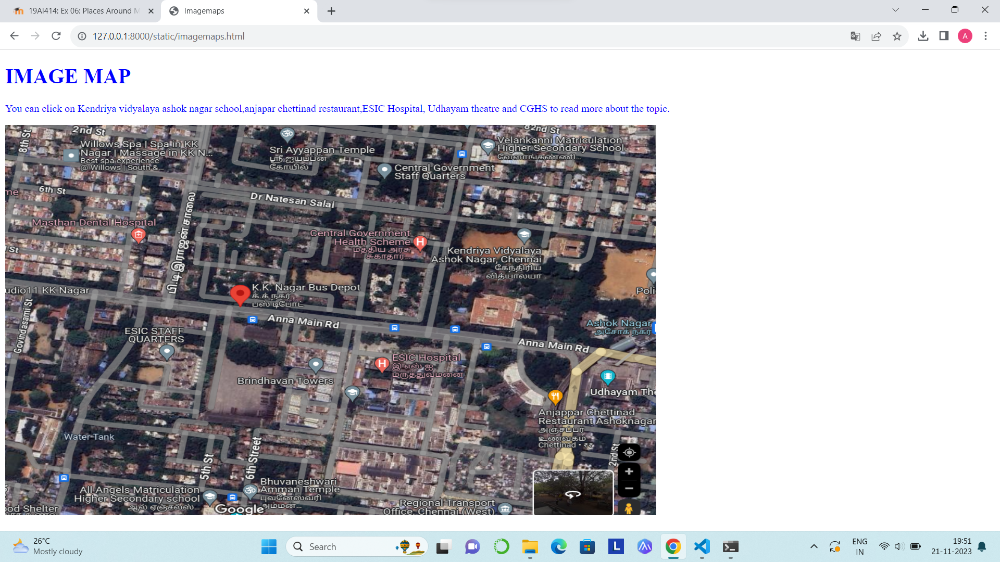
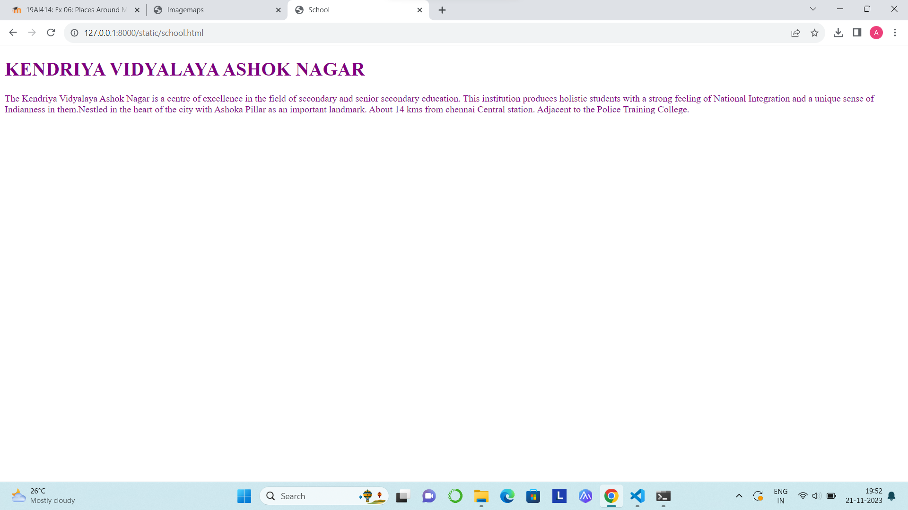
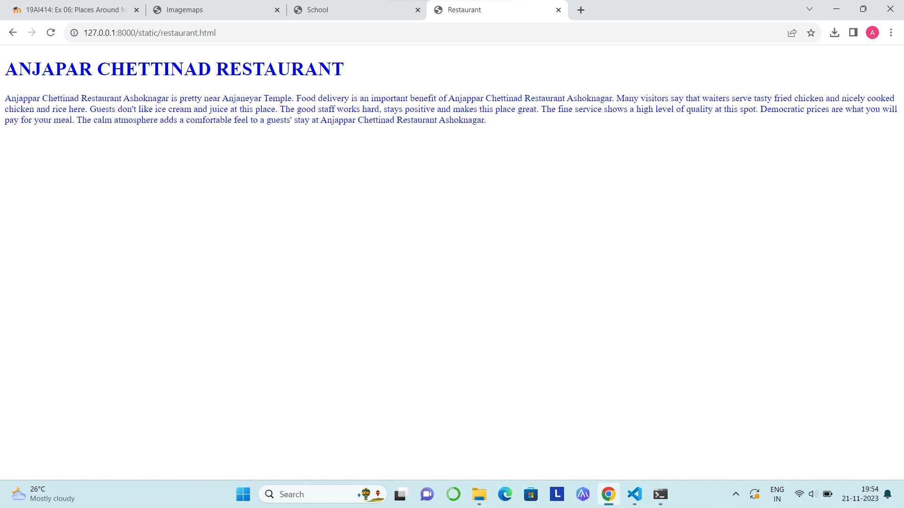
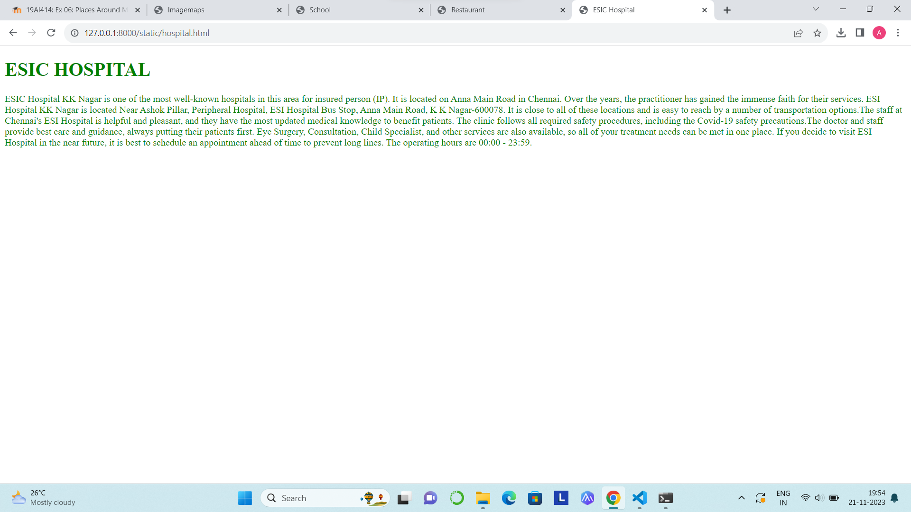
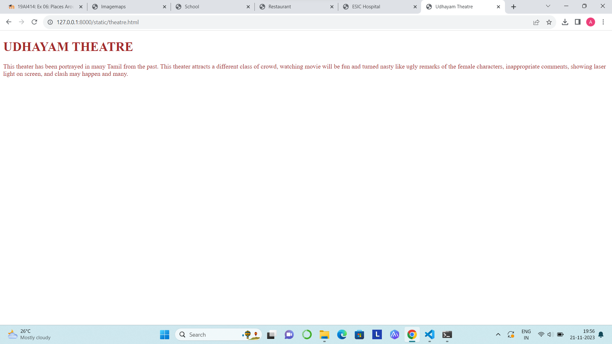
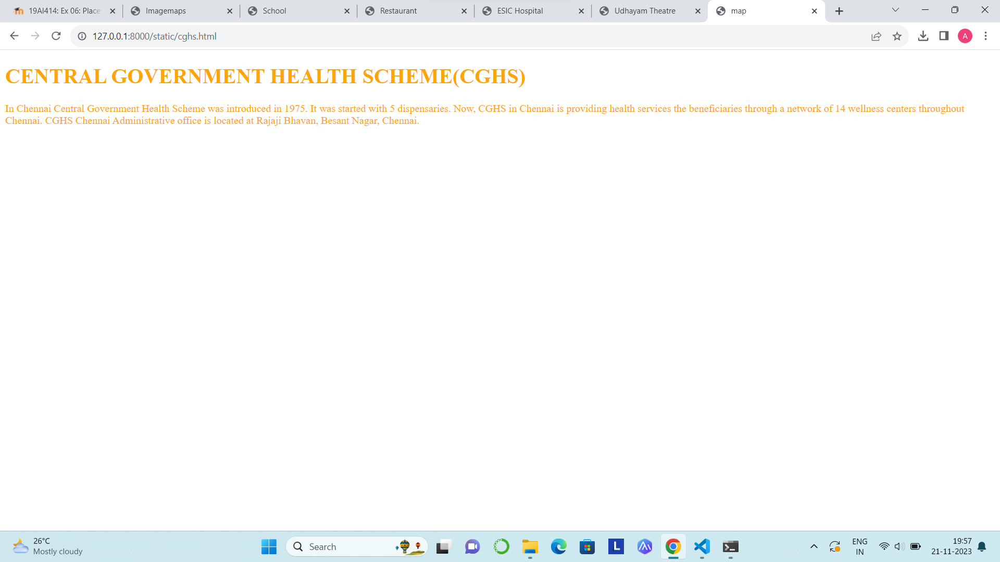

# Places Around Me

Name: Amruthavarshini gopal

Register Number: 23000851

Department: Artificial Intelligence and Data science

# Aim:

To develop a website to display details about the places around my house.

# Design Steps:

## Step 1:

Create a folder 'static' under the project folder 'projects'

## Step 2:

In 'static',create another folder 'html',under which the file 'imagemaps.html' should be created

## Step 3:

Go to google maps and take a screenshot of ypur home along with some places around it

## Step 4:

Go to image-maps.com and make five locations on it using the shapes used in maps

## Step 5:

Copy the html code for the map and add it to 'imagemaps.html'

## Step 6:

Create the html documents to be displayed when clicked on the location in the image map

## Step 7:

Take screenshots of the output

## Step 8:

Push it to 'README.md' and push it to the repository

# Code:

imagemaps.html
```
<!DOCTYPE html>
<html>
    <head>
        <title>Imagemaps</title>
    </head>
    <body text="blue">
        <h1><b>IMAGE MAP</b></h1>
        <p>You can click on Kendriya vidyalaya ashok nagar school,anjapar chettinad restaurant,ESIC Hospital, 
        Udhayam theatre and CGHS to read more about the topic.</p>
        
        <map name="workmap">
            <area shape="circle" coords="766,268,85" alt="school" href="school.html">
            <area shape="circle" coords="919,613,113"alt="restaurent" href="restaurant.html">
            <area shape="circle" coords="652,497,91" alt="hospital" href="hospital.html">
            <area shape="circle" coords="957,522,46" alt="theatre" href="theatre.html">
            <area shape="circle" coords="660,248,48" alt="Central government Health scheme" href="health.html">
          </map>
    </body>
</html>
```

school.html
```
<!DOCTYPE html>
<html>
<head>
    <title>School</title>
</head>
    <body text="purple">
        <h1><b>KENDRIYA VIDYALAYA ASHOK NAGAR</b></h1>
        <p>The Kendriya Vidyalaya Ashok Nagar is a centre of excellence in the field of secondary and senior secondary education.
             This institution produces holistic students with a strong feeling of National Integration and a unique sense 
             of Indianness in them.Nestled in the heart of the city with Ashoka Pillar as an important landmark. About 14 kms from chennai Central station.
             Adjacent to the Police Training College.</p>
    </body>
    </html>
```
restaurant.html
```
<!DOCTYPE html>
<html>
<head>
    <title>Restaurant</title>
</head>
<body text="light blue">
<h1><b>ANJAPAR CHETTINAD RESTAURANT</b></h1>
<p>Anjappar Chettinad Restaurant Ashoknagar is pretty near Anjaneyar Temple. 
Food delivery is an important benefit of Anjappar Chettinad Restaurant Ashoknagar.
 Many visitors say that waiters serve tasty fried chicken and nicely cooked chicken and rice here. 
Guests don't like ice cream and juice at this place.
The good staff works hard, stays positive and makes this place great. 
The fine service shows a high level of quality at this spot.
 Democratic prices are what you will pay for your meal. 
 The calm atmosphere adds a comfortable feel to a guests' stay at Anjappar Chettinad Restaurant Ashoknagar.</p>
 </body>
 </html>
 ```
hospital.html
```
<!DOCTYPE html>
<html>
<head>
    <title>ESIC Hospital</title>
</head>
<body text="green">
    <h1><b>ESIC HOSPITAL</b></h1>
    <p>ESIC Hospital KK Nagar is one of the most well-known hospitals in this area for insured person (IP).
        It is located on Anna Main Road in Chennai. Over the years, the practitioner has gained the immense faith for their services.
        ESI Hospital KK Nagar is located Near Ashok Pillar, Peripheral Hospital, ESI Hospital Bus Stop, Anna Main Road, K K Nagar-600078.
        It is close to all of these locations and is easy to reach by a number of transportation options.The staff at Chennai's 
        ESI Hospital is helpful and pleasant, and they have the most updated medical knowledge to benefit patients.
        The clinic follows all required safety procedures, including the Covid-19 safety precautions.
        The doctor and staff provide best care and guidance, always putting their patients first.
        Eye Surgery, Consultation, Child Specialist, and other services are also available, so all of your treatment 
        needs can be met in one place.
        If you decide to visit ESI Hospital in the near future, it is best to schedule an appointment ahead of time to prevent 
        long lines. 
        The operating hours are 00:00 - 23:59.</p>
</body>
</html>
```
theatre.html
```
<!DOCTYPE html>
<html>
<head>
    <title>Udhayam Theatre</title>
</head>
<body text="brown">
    <h1><b>UDHAYAM THEATRE</b></h1>
    <p>This theater has been portrayed in many Tamil from the past.
         This theater attracts a different class of crowd, watching movie will be fun 
         and turned nasty like ugly remarks of the female characters, inappropriate comments, 
         showing laser light on screen, and clash may happen and many.
    </p>
</body>
</html>
```
cghs.html
```
<!DOCTYPE html>
<html>
<head>
    <title>map</title>
</head>
<body text="orange">
    <h1><b>CENTRAL GOVERNMENT HEALTH SCHEME(CGHS)</b></h1>
    <p>In Chennai Central Government Health Scheme was introduced in 1975. 
        It was started with 5 dispensaries. Now, CGHS in Chennai is providing health services 
        the beneficiaries through a network of 14 wellness centers throughout Chennai. CGHS Chennai
         Administrative office is located at Rajaji Bhavan, Besant Nagar, Chennai.</p>
</body>
</html>
```
# Output:













# Result:

The output was verified successfully

